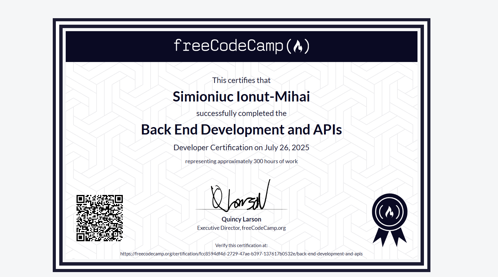

# FreeCodeCamp Backend Certification Projects

## Certification



This repository contains all the projects completed for the FreeCodeCamp Backend & APIs Certification.  
Through these projects, I learned and practiced essential backend development skills using **Node.js**, **Express**, and various related technologies.

---

## What I Learned

- **Node.js & Express:**  
  - Setting up servers and routing
  - Handling HTTP requests and responses
  - Serving static files and HTML pages

- **API Design & RESTful Endpoints:**  
  - Creating GET, POST endpoints
  - Using route parameters and query parameters
  - Returning JSON responses

- **Middleware:**  
  - Using built-in and custom middleware for validation, parsing, and error handling
  - Applying CORS for cross-origin requests
  - Using body-parser for form and JSON data

- **Data Validation:**  
  - Validating input data (URLs, dates, etc.)
  - Handling errors and sending appropriate responses

- **File Uploads:**  
  - Handling multipart/form-data with Multer
  - Extracting file metadata

- **Short URL Service:**  
  - Generating and storing short URLs in memory
  - Redirecting users to original URLs

- **Header Parsing:**  
  - Extracting client information from request headers (IP, language, software)

- **Exercise Tracker:**  
  - Managing users and exercise logs in memory
  - Filtering and limiting results with query parameters

- **Timestamp Microservice:**  
  - Parsing and validating dates from URL parameters
  - Returning Unix and UTC formats

- **Swagger Documentation:**  
  - Auto-generating API docs with Swagger JSDoc and Swagger UI

- **MongoDB & Mongoose:**  
  - Connecting to MongoDB Atlas
  - Defining schemas and models
  - Performing CRUD operations

- **Environment Variables:**  
  - Using `.env` files for configuration

- **Version Control:**  
  - Using Git and GitHub for project management

---

## Projects Included

- **Timestamp Microservice**
- **Header Parser Microservice**
- **URL Shortener Microservice**
- **Exercise Tracker**
- **File Metadata Microservice**
- **MongoDB & Mongoose Challenges**

Each project is in its own folder and can be run independently.

## Deployment

All projects were also deployed and tested using [Replit](https://replit.com/@simioniucionut), allowing public API access and automated FreeCodeCamp testing.

---

## How to Run

1. Install dependencies:  
   ```
   npm install
   ```
2. Start the server:  
   ```
   npm start
   ```
3. Access endpoints in your browser or with Postman.

---

## Useful Links

- [FreeCodeCamp Backend Certification](https://www.freecodecamp.org/learn/back-end-development-and-apis/)
- [Express Documentation](https://expressjs.com/)
- [Node.js Documentation](https://nodejs.org/en/docs/)
- [MongoDB Documentation](https://www.mongodb.com/docs/)
- [Swagger Documentation](https://swagger.io/docs/)

---

**This certification demonstrates practical backend skills, API design, data validation, documentation, and integration with databases and

